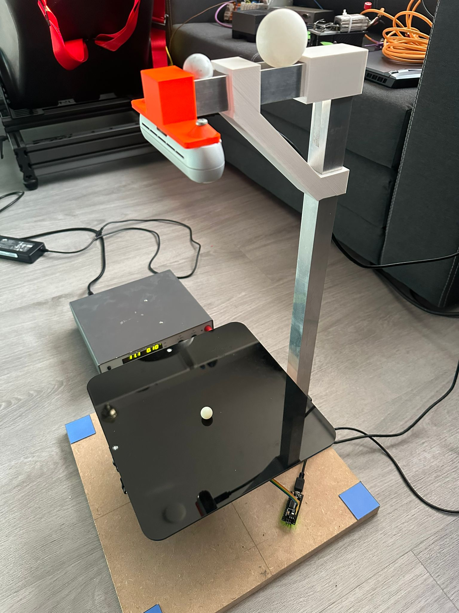
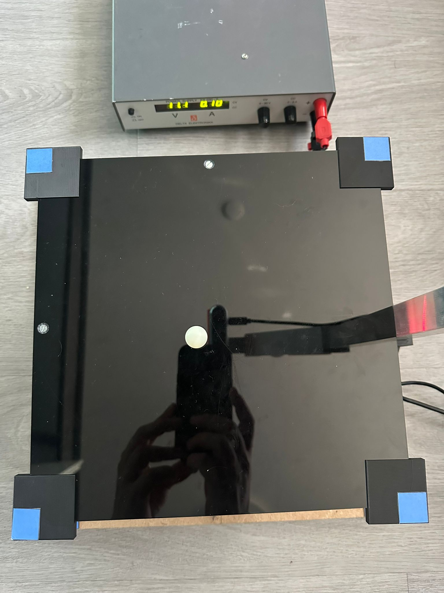
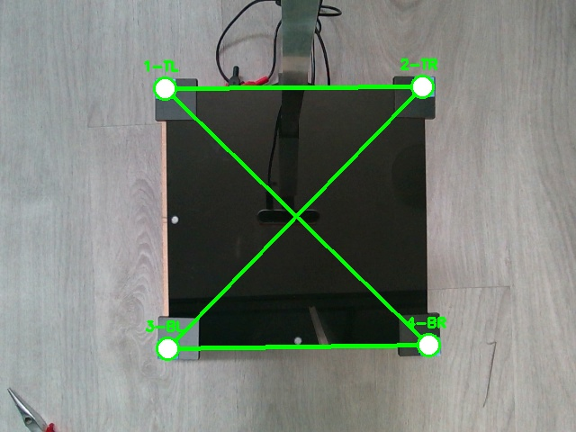
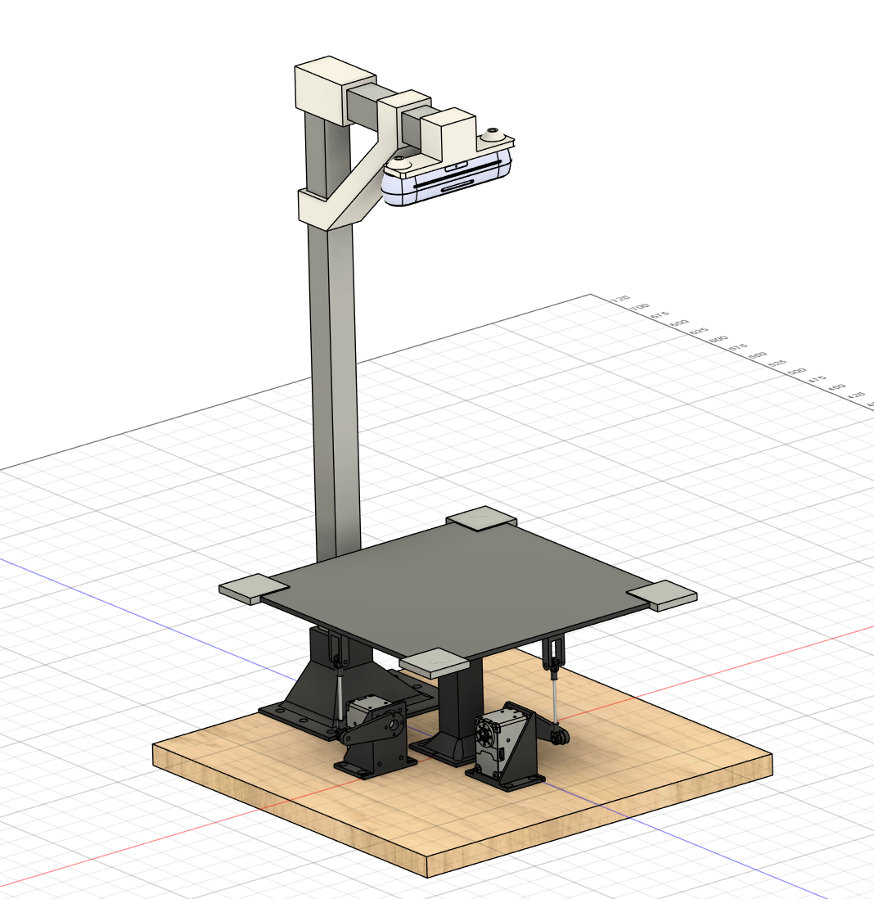
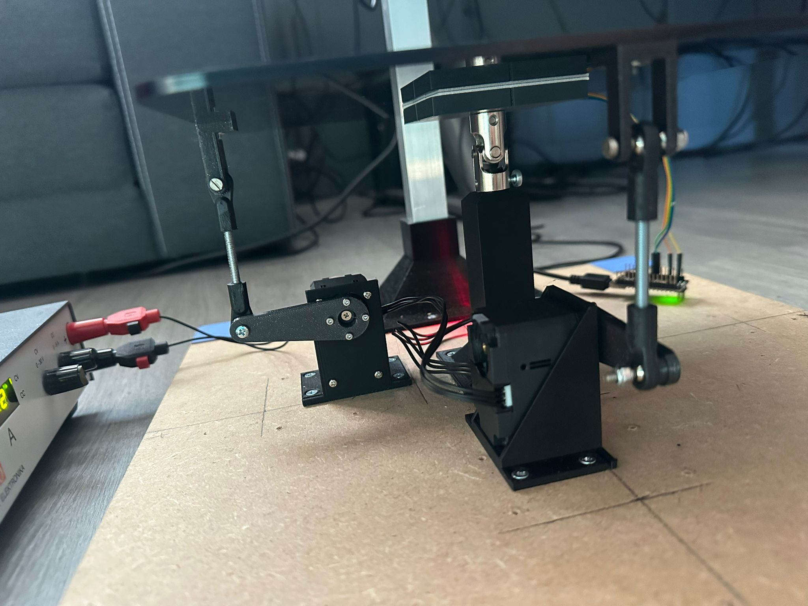

# Ball Balancing Table

A complete ball balancing control system featuring advanced reinforcement learning with sim-to-real transfer, PID control, and real hardware integration. The system uses PyBullet simulation, camera integration, IMU feedback, and Dynamixel servo control for robust real-world deployment.


*Complete system overview showing hardware integration*

## Demo
[](https://youtu.be/B2ETYDegp2Y)
## 🎯 Key Features

### Control Methods
- **🎛️ PID Control**: Well-tuned traditional controller with IMU feedback correction
- **🤖 SAC Reinforcement Learning**: Advanced RL with curriculum learning, domain randomization, and target tracking
- **📐 LQR Control**: Linear-Quadratic Regulator for comparison
- **⚡ Real-time Switching**: Change control methods during operation

### Operating Modes
- **🖥️ Pure Simulation**: PyBullet physics simulation only
- **🔗 Hybrid Mode**: Camera input with simulated physics for testing
- **🏗️ Hardware Mode**: Full camera + servo + IMU deployment

### Advanced RL Features
- **🎯 Target Tracking**: RL learns to drive ball to arbitrary setpoints, not just center
- **🔄 Curriculum Learning**: Progressive difficulty from easy to challenging scenarios
- **🎲 Domain Randomization**: Actuation biases, servo dynamics, and physics variation
- **🦾 Servo Dynamics**: Rate-limited servo movement matching real hardware (60-63Hz)
- **📊 PID Guidance**: Reward shaping using PD baseline for stable, damped behavior
- **🎚️ Anti-Oscillation**: Jerk penalties and velocity weighting to prevent chattering


*PID controller demonstration showing stable ball positioning*


*RL controller adapting to mass changes in hybrid mode*

## 🚀 Quick Start

### Installation
```bash
# Install dependencies
pip install -r requirements.txt

# Setup project directories
python setup.py
```

### Basic Usage
```bash
# Pure simulation with PID
python compare_control.py --control pid --freq 60 --visuals

# Test trained RL model
python compare_control.py --control rl --freq 60 --visuals

# Hardware deployment with IMU
python compare_control.py --camera real --servos --imu --freq 60
```

### Train New RL Models
```bash
cd reinforcement_learning

# Train with curriculum and domain randomization
python train_rl.py --mode train --freq 60 --tensorboard --curriculum

# Test trained model
python train_rl.py --mode test --freq 60 --model ./models/best_model.zip

cd ..
```

## 🎮 Interactive Controls

**During operation:**
- `r` - Reset ball position
- `f` - Toggle fixed/random ball spawn
- `b` - Switch to PID control
- `n` - Switch to RL control
- `c` - Calibrate IMU offsets (hardware mode)
- `q` - Quit
- **Arrow keys/WASD** - Manual setpoint control

## 🤖 Advanced RL Training

### Current Training Environment
The RL system is designed for robust sim-to-real transfer:

**Observation Space**: `[ball_x_error, ball_y_error, ball_vx, ball_vy, table_pitch, table_roll]`
- Ball positions are relative to target setpoint
- Includes optional observation noise for robustness

**Action Space**: Normalized `[-1, 1]` scaled to table angle deltas
- Actions are rate-limited to match real servo dynamics
- Includes actuation bias randomization (offsets, gains, cross-coupling)

**Reward Function** (carefully tuned for stability):
- **Distance penalty**: Exponential decay based on error to target
- **Velocity penalty**: Strong weighting (0.9) to encourage stillness
- **Control effort**: Light penalty (0.05) on action magnitude
- **Jerk penalty**: New addition (0.08) to prevent oscillation
- **Angle penalty**: Penalize extreme table tilts
- **Progress bonus**: Reward for reducing distance to target
- **PID guidance**: Bonus for following PD baseline behavior
- **Stability bonuses**: Extra reward for precise, still positioning

### Curriculum Learning
Three progressive stages automatically applied during training:

1. **Easy** (0-200k steps):
   - Small spawn range (±5cm)
   - Fixed center target
   - Minimal actuation biases
   - Conservative angle changes

2. **Medium** (200k-500k steps):
   - Larger spawn range (±8cm)
   - Randomized targets (±6cm)
   - Moderate biases and coupling

3. **Hard** (500k+ steps):
   - Full table coverage (±10cm)
   - Wide target range (±8cm)
   - Full actuation bias randomization
   - Maximum servo speed jitter

### Domain Randomization
Per-episode randomization includes:
- **Physics**: Ball mass (1.8-2.2g), friction (0.22-0.30)
- **Actuation biases**: Servo offsets (±1°), gains (±5%), cross-coupling (±5%)
- **Servo dynamics**: Speed jitter (±20%) around 60Hz rate limiting
- **Observation noise**: Position (0.001m) and velocity (0.02m/s) Gaussian noise

### Training Commands
```bash
cd reinforcement_learning

# Standard training with all features
python train_rl.py --mode train --freq 60 --tensorboard --curriculum

# Extended training without early stopping
python train_rl.py --mode train --freq 60 --tensorboard --curriculum --no-early-stop

# Resume from checkpoint
python train_rl.py --mode train --resume-from checkpoints/checkpoint_500000_steps

# Test specific model
python train_rl.py --mode test --model ./models/best_model.zip
```

## 🦾 Hardware Integration

### Servo System (Dynamixel)
- **Models**: XL430-W250-T or similar
- **Communication**: 1 Mbps, 60-63Hz update rate
- **IDs**: 1 (pitch), 2 (roll)
- **Range**: ±9° table movement
- **Kinematic Corrections**: Optional bias compensation via `servo_kinematics.json`

### IMU Integration (BNO055)
- **Real-time angle correction**: Compensates for servo/mechanical imperfections
- **Calibration**: Built-in offset calibration (press 'c' during operation)
- **RL Integration**: 0.2 correction gain for RL controller on hardware

### Camera System (RealSense D435i)
- **Ball tracking**: HSV-based detection with filtering
- **Coordinate mapping**: Automatic table-to-camera transformation
- **Modes**: Hybrid (sim physics) or Real (hardware physics)


*Blue corner markers used for camera calibration*


*Camera calibration interface showing marker detection*

## ⚙️ Configuration Options

### Control Flags
```bash
--control [pid|rl|lqr]     # Controller type
--freq 60                  # Control frequency (Hz)
--visuals                  # Enable real-time dashboard
```

### Camera Modes
```bash
--camera simulation        # Pure PyBullet (default)
--camera hybrid           # Camera + simulation physics
--camera real             # Camera + hardware physics
```

### Hardware Flags
```bash
--servos                  # Enable Dynamixel control
--imu                     # Enable IMU feedback
--imu-port COM3           # IMU serial port
--calibrate              # Run camera calibration
```

### RL-Specific Flags
```bash
--rl-swap-axes           # Swap X/Y observation axes
--rl-invert-x            # Invert X axis observation
--rl-invert-y            # Invert Y axis observation
```

## 📁 Project Structure

```
├── compare_control.py              # Main control system with PID/RL/LQR
├── pid_controller.py               # PID implementation
├── lqr_controller.py               # LQR implementation
├── servo/
│   ├── servo_controller.py         # Dynamixel control with kinematic corrections
│   ├── servo_kinematics.json       # Bias compensation parameters
│   └── servo_test.py               # Hardware testing utilities
├── camera/
│   ├── camera_interface.py         # RealSense integration
│   └── camera_calibration_color.py # Calibration tools
├── imu/
│   └── imu_simple.py               # BNO055 IMU interface
├── reinforcement_learning/
│   ├── train_rl.py                 # SAC training with curriculum
│   ├── ball_balance_env.py         # Advanced training environment
│   ├── models/                     # Trained models
│   ├── tensorboard_logs/           # Training monitoring
│   └── checkpoints/                # Training checkpoints
├── calibration_data/               # Camera calibration files
└── requirements.txt                # Python dependencies
```


*Mechanical design showing servo actuation system*


*Servo-driven platform mechanism for precise table control*

## 🎯 Current State & Performance

### ✅ Completed Features
- **Robust RL Training**: Curriculum learning with domain randomization
- **Sim-to-Real Transfer**: Servo dynamics, bias randomization, IMU correction
- **Target Tracking**: RL learns to drive ball to arbitrary setpoints
- **Hardware Integration**: Full servo + camera + IMU deployment
- **Anti-Oscillation**: Jerk penalties and velocity weighting prevent chattering
- **TensorBoard Monitoring**: Unique run naming and comprehensive metrics

### 🎯 Performance Characteristics
- **PID Controller**: "Snappy" and stable with IMU correction, excellent hardware performance
- **RL Controller**: Converges after ~1.2-1.8M steps with current reward shaping
  - Tracks setpoints like PID
  - Benefits from IMU correction (0.2 gain) on hardware
  - Robust to actuation biases through training randomization

### 🔬 Training Insights
- **Early Stopping**: Threshold set to 85% of expected reward (accounts for new reward scale)
- **Convergence**: Slower with added realism but produces more robust policies
- **Hardware Transfer**: IMU correction and bias randomization critical for real-world performance
- **Oscillation Prevention**: Jerk penalties and servo rate limiting eliminate chattering

## 🚀 Development Workflow

### 1. Algorithm Development
```bash
# Test in pure simulation
python compare_control.py --control pid --visuals --freq 60
```

### 2. RL Training
```bash
# Train with full curriculum and randomization
cd reinforcement_learning
python train_rl.py --mode train --freq 60 --tensorboard --curriculum
cd ..
```

### 3. Validation
```bash
# Test RL in simulation
python compare_control.py --control rl --visuals --freq 60

# Hybrid testing with camera
python compare_control.py --camera hybrid --control rl --visuals --freq 60
```

### 4. Hardware Deployment
```bash
# Full hardware deployment
python compare_control.py --camera real --servos --imu --freq 60
```

## 💡 Tips & Best Practices

### Training Considerations
- **Match frequencies**: Use 60Hz for both training and hardware
- **Curriculum is essential**: Start with `--curriculum` flag
- **Monitor TensorBoard**: Each run gets unique timestamp naming
- **Expect slow convergence**: Current reward shaping prioritizes stability over speed

### Hardware Deployment
- **IMU calibration**: Press 'c' to calibrate offsets before operation
- **Axis alignment**: Use `--rl-swap-axes`, `--rl-invert-x/y` flags if needed
- **Setpoint tracking**: RL automatically receives error-to-setpoint observations
- **Bias compensation**: Training randomization handles most hardware imperfections

### Troubleshooting
- **RL oscillation**: Increase jerk penalty weight or reduce servo speed
- **Off-center settling**: Calibrate IMU offsets, check coordinate system alignment
- **Sluggish response**: Verify control frequency matches training (60Hz)
- **Poor transfer**: Ensure domain randomization covers actual hardware characteristics

## 📋 System Requirements

**Software:**
- Python 3.8+ (on linux)
- Python 3.11+ (on windows, else the loop time will not be quick enough)
- PyBullet (physics simulation)
- Stable-Baselines3 (SAC algorithm)
- OpenCV (camera processing)
- pyrealsense2 (camera interface)
- dynamixel_sdk (servo control)
- matplotlib (visualization)

**Hardware:**
- Intel RealSense D435i camera
- 2× Dynamixel servos (XL430-W250-T recommended)
- BNO055 IMU sensor
- USB-Serial interface for servos
- Ball balancing platform with markers