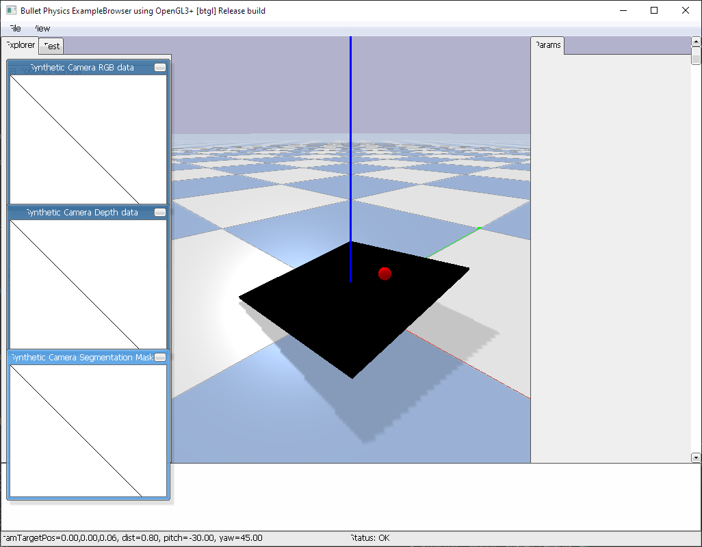

# Ball Balancing Table

A physics simulation of a ball balancing on a pivoting table, featuring both PID control and Reinforcement Learning approaches.



## Features

- **PID Control**: Traditional control system that works reliably
- **Reinforcement Learning**: PPO agent trained to balance the ball
- **Comparison Mode**: Switch between control methods in real-time
- **Physics Simulation**: Built with PyBullet for realistic physics

## Quick Start

1. **Setup Environment**:
   ```bash
   python setup.py
   ```

2. **Test PID Control** (your working system):
   ```bash
   python compare_control.py --control pid
   ```

3. **Train RL Agent**:
   ```bash
   python train_rl.py --mode train
   ```

4. **Test RL Agent**:
   ```bash
   python train_rl.py --mode test
   ```

5. **Compare Both Methods**:
   ```bash
   python compare_control.py --control rl
   ```

## Controls

During simulation, use these keyboard shortcuts:
- `r` - Reset ball position
- `p` - Switch to PID control
- `l` - Switch to RL control (if trained)
- `q` - Quit simulation

## Project Structure

```
├── simulation.py          # Original PID-only simulation
├── pid_controller.py      # PID controller implementation
├── ball_balance_env.py    # Gymnasium environment for RL
├── train_rl.py           # RL training and testing scripts
├── compare_control.py    # Interactive comparison tool
├── setup.py              # Setup and installation script
├── requirements.txt      # Python dependencies
├── models/               # Trained RL models (created after training)
└── tensorboard_logs/     # Training logs (created after training)
```

## Reinforcement Learning Details

### Environment
- **Observation Space**: Ball position and table angles (4 dimensions - position only for fair comparison with PID)
- **Action Space**: Changes to table pitch and roll angles (2 dimensions)
- **Reward Function**: 
  - Distance from center (primary)
  - Velocity penalty (stability)
  - Angle penalty (efficiency)
  - Bonus for staying near center

### Training
- **Algorithm**: PPO (Proximal Policy Optimization)
- **Training Steps**: 100,000 steps
- **Evaluation**: Every 5,000 steps
- **Monitoring**: TensorBoard logs available

Monitor training progress:
```bash
tensorboard --logdir=./tensorboard_logs/
```

## Next Steps

1. **Tune Hyperparameters**: Experiment with different RL parameters
2. **Add Camera Input**: Integrate computer vision for real-world deployment
3. **Hardware Integration**: Connect to actual servos and camera
4. **Advanced Algorithms**: Try other RL algorithms (SAC, TD3, etc.)
5. **Curriculum Learning**: Start with easier tasks and gradually increase difficulty

## Tips for RL Development

- Start with your working PID system as a baseline
- The RL environment is designed to be compatible with your existing physics setup
- Training can take time - use the comparison tool to see immediate results
- Monitor training with TensorBoard to understand learning progress
- Experiment with reward function design for different behaviors
