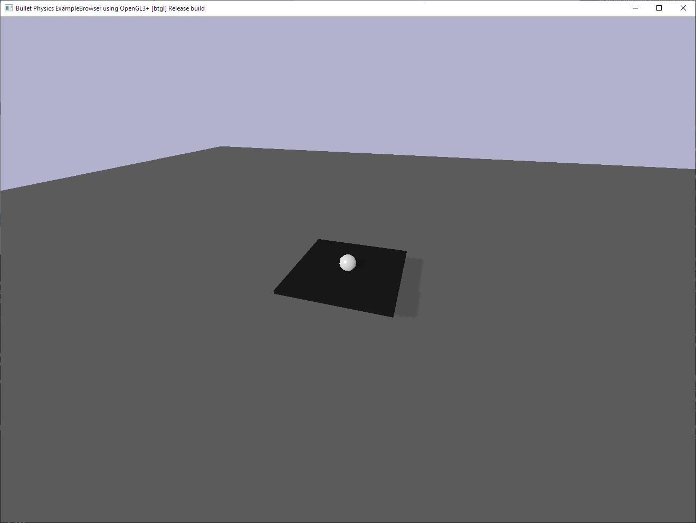
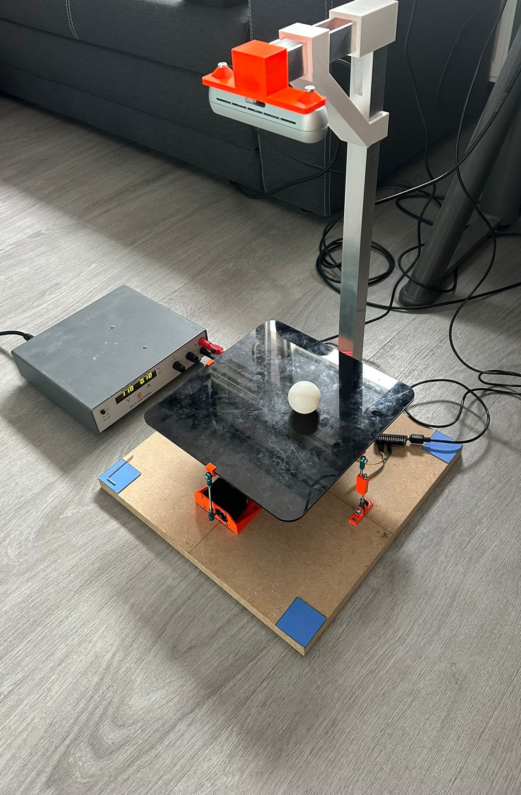
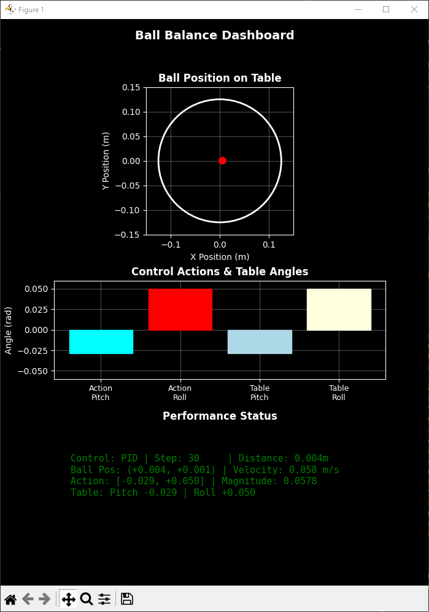
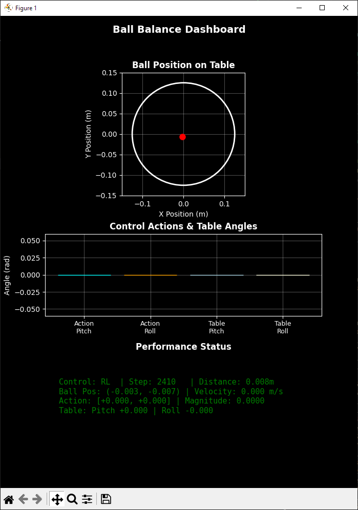
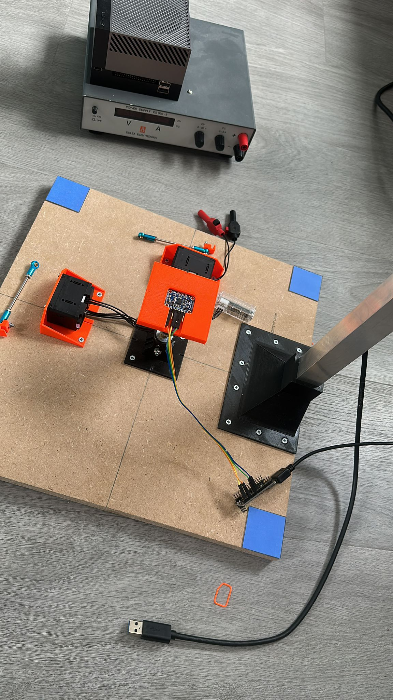
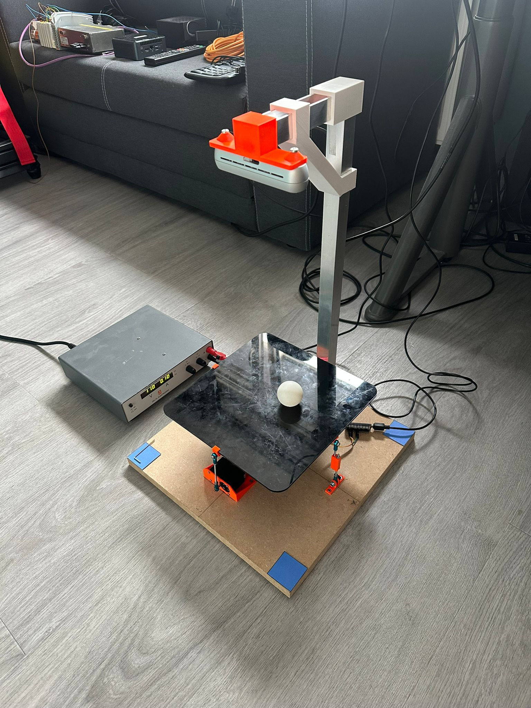
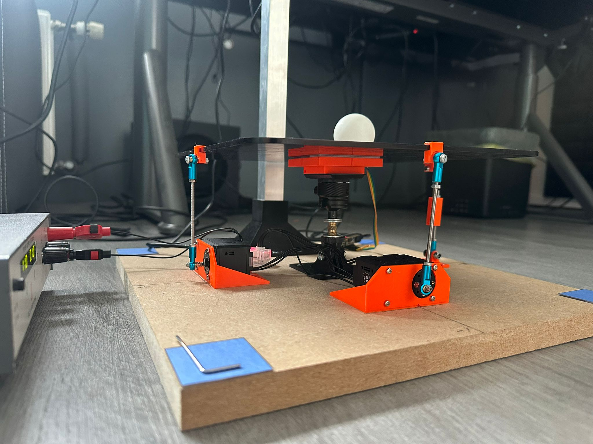
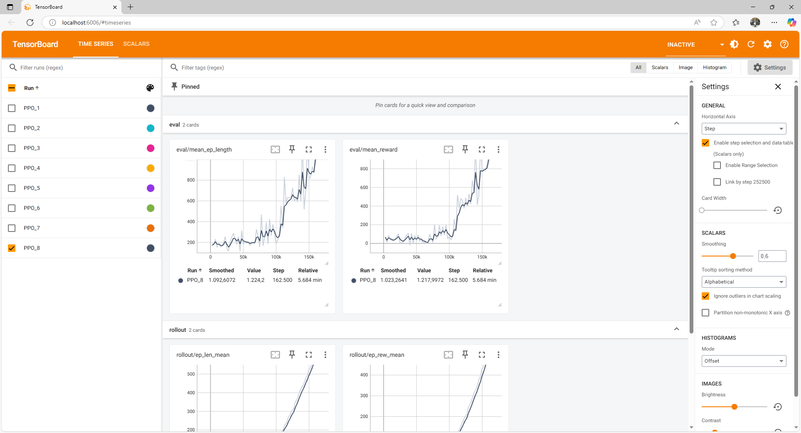

# Ball Balancing Table

A complete ball balancing control system with **simulation**, **camera integration**, and **hardware control**. Features PID and Reinforcement Learning controllers with real-time visual monitoring and servo control for physical deployment.


*PyBullet physics simulation for algorithm development*


*Complete physical setup with RealSense D435i camera and servo-controlled platform*

## 🎯 Features

### Unified Control System
- **🎛️ PID Control**: Traditional control with tuned parameters
- **🤖 Reinforcement Learning**: PPO agent with advanced reward engineering  
- **📷 Camera Integration**: RealSense camera for real-world ball tracking
- **🦾 Servo Control**: Dynamixel servo integration for hardware deployment
- **⚡ Real-time Switching**: Change control methods during operation

### Operating Modes
- **🖥️ Pure Simulation**: PyBullet physics simulation only
- **🔗 Hybrid Mode**: Camera input + simulated physics for testing
- **🏗️ Hardware Mode**: Full camera + servo deployment


*Real-time hybrid mode: camera tracking with simulation physics*


*Robust control response to external disturbances*

### Visual Dashboard
- **📊 Real-time Monitoring**: Live ball position, control actions, and performance metrics
- **🎨 Professional Interface**: Clean, dark-themed dashboard with color-coded status
- **📈 Performance Analysis**: Distance tracking, velocity monitoring, and control efficiency


*Real-time PID controller dashboard with performance metrics*


*PID control demonstration showing stable ball positioning*


*Reinforcement learning controller dashboard with training metrics*

## 🚀 Quick Start

### 1. Installation
```bash
# Install dependencies
pip install -r requirements.txt

# Setup project (creates all necessary directories)
python setup.py
```

### 2. Basic Simulation
```bash
# Pure simulation with PID control
python compare_control.py --control pid --visuals

# Test RL control (if model available)
python compare_control.py --control rl --visuals
```

### 3. Train RL Agent
```bash
# Navigate to RL directory
cd reinforcement_learning

# Train with TensorBoard monitoring
python train_rl.py --mode train --tensorboard

# Test trained model
python train_rl.py --mode test

# Return to main directory
cd ..
```

### 4. Camera Integration
```bash
# Calibrate camera first (requires RealSense + blue markers)
python compare_control.py --camera hybrid --calibrate

# Run hybrid mode with camera input
python compare_control.py --camera hybrid --visuals
```

### 5. Hardware Deployment
```bash
# Full hardware mode with servos
python compare_control.py --camera real --servos --calibrate
```

## 🎮 Interactive Controls

**Keyboard shortcuts during operation:**
- `r` - Reset ball position
- `f` - Toggle fixed/random ball positions  
- `p` - Switch to PID control
- `l` - Switch to RL control
- `q` - Quit

## ⚙️ Configuration Options

### Camera Modes
- `--camera simulation` - Pure PyBullet simulation (default)
- `--camera hybrid` - Camera input + simulated physics  
- `--camera real` - Camera only for hardware deployment

### Control Options
- `--control pid` - Start with PID controller (default)
- `--control rl` - Start with RL controller
- `--freq 50` - Control frequency in Hz (default: 50)

### Hardware Integration
- `--servos` - Enable Dynamixel servo control
- `--calibrate` - Run camera calibration before starting
- `--visuals` - Enable real-time dashboard

### Example Commands
```bash
# Development: Hybrid mode with visuals
python compare_control.py --camera hybrid --visuals --servos

# Hardware: Full deployment
python compare_control.py --camera real --servos --calibrate

# Simulation: Performance testing  
python compare_control.py --control rl --freq 100 --visuals
```

## 🔧 Hardware Setup

### Camera System
- **Intel RealSense D435i** (or compatible)
- **35×35cm wooden base plate** with 4 blue corner markers
- **Camera positioned above table** for full table view


*Embedded BNO055 IMU sensor for additional feedback*

### Servo System  
- **2× Dynamixel servos** (XM430-W350 or similar)
- **USB interface** (U2D2 or compatible)
- **Kinematic model**: Half servo range = 3° table movement


*Dynamixel servo configuration with mounting hardware*


*Mechanical constraint system for controlled platform movement*

### Calibration Requirements
- 4× **4cm blue markers** at base plate corners
- **Good lighting** for consistent marker detection
- **No ball on table** during calibration

## 📁 Project Structure

```
├── compare_control.py         # 🎯 Main unified control system
├── pid_controller.py          # 🎛️ PID controller implementation
├── setup.py                   # 🔧 Project setup and initialization
├── requirements.txt           # 📦 Python dependencies
├── servo/                     # 🦾 Hardware control
│   ├── servo_controller.py    # 🎛️ Servo control with kinematics
│   └── servo_test.py          # 🧪 Servo testing utilities
├── camera/                    # 📷 Vision system
│   ├── camera_interface.py    # 📷 Camera integration & ball detection
│   └── camera_calibration_color.py # 🎯 Camera calibration tool
├── imu/                       # 🧭 IMU integration
│   └── imu_simple.py          # 📐 IMU feedback system
├── reinforcement_learning/    # 🤖 RL training system
│   ├── train_rl.py           # 🚀 RL training with TensorBoard
│   ├── ball_balance_env.py   # 🏋️ Training environment
│   ├── recovery_tool.py      # 🔄 Training checkpoint management
│   ├── models/               # � Trained RL models
│   ├── tensorboard_logs/     # 📊 Training monitoring
│   └── checkpoints/          # � Training checkpoints
├── calibration_data/         # 📐 Camera calibration files
├── models/                   # 🧠 Main directory models (legacy)
└── media/                    # 📸 Documentation images
```

## 🎯 Current State & Next Steps

### ✅ Completed Features
- **Unified Control Framework**: PID and RL comparison system
- **Hardware Integration**: Servo control, camera integration, IMU feedback
- **Visual Monitoring**: Real-time dashboard and TensorBoard integration
- **Modular Architecture**: Organized codebase with clear separation

### 🚧 Current Focus: Simulation-to-Real Transfer
The project is now focused on improving **simulation accuracy** and **RL transfer learning** for robust real-world deployment:

#### **Simulation Accuracy Improvements Needed:**
- **Physical Parameters**: Fine-tune ball mass, friction, air resistance
- **Sensor Modeling**: Add realistic camera noise, IMU drift, servo backlash
- **Timing Accuracy**: Match real hardware control frequencies and delays
- **Environmental Factors**: Lighting variations, surface imperfections

#### **RL Transfer Learning Strategy:**
- **Domain Randomization**: Vary physical parameters during training
- **Progressive Training**: Start simple, gradually add complexity
- **Real-World Data**: Incorporate actual system measurements
- **Robust Reward Design**: Reward functions that generalize across domains

### 🎯 Planned Enhancements
1. **Enhanced Physics Simulation**
   - More accurate ball-table contact modeling
   - Realistic servo dynamics and limitations
   - Environmental disturbance simulation

2. **Advanced RL Training**
   - Multi-environment training with domain randomization
   - Curriculum learning for progressive difficulty
   - Meta-learning for quick adaptation to new conditions

3. **Transfer Learning Pipeline**
   - Systematic sim-to-real validation framework
   - Performance metrics for transfer quality assessment
   - Automated hyperparameter optimization

## 🤖 Reinforcement Learning

### Training New Models
```bash
# Navigate to RL directory
cd reinforcement_learning

# Train RL agent with TensorBoard monitoring
python train_rl.py --mode train --tensorboard --freq 60

# Train without early stopping for full convergence
python train_rl.py --mode train --no-early-stop --tensorboard

# Test trained model
python train_rl.py --mode test

# Return to main directory for testing
cd ..
```

### Advanced Training Options
```bash
# Resume from checkpoint
python train_rl.py --mode train --resume-from checkpoints/ball_balance_checkpoint_100000_steps

# Train with visual rendering (slower but helpful for debugging)
python train_rl.py --mode train --render --tensorboard

# Recover from training issues
python train_rl.py --mode recover
```

### Environment Details
- **Observation**: Ball position (x,y), velocity (vx,vy), table angles (pitch,roll)
- **Actions**: Table angle changes (±0.05 rad)  
- **Reward**: Distance minimization + energy optimization + oscillation prevention
- **Physics**: 25cm table, 2.7g ball, realistic dynamics

### Current Training Status
The RL system is designed for **simulation-to-real transfer**:

- **Domain Randomization**: Ready for physics parameter variation
- **Robust Reward Function**: Generalizes across different conditions  
- **Checkpoint System**: Enables training recovery and model comparison
- **TensorBoard Integration**: Comprehensive training monitoring

**Next Steps for Transfer Learning:**
- Implement domain randomization during training
- Add realistic sensor noise and delays
- Train with curriculum learning for robustness

### Training Results

The PPO training shows excellent convergence with the improved reward function:



**Key Training Metrics:**
- **Episode Reward Mean**: Steady improvement from -100 to optimal performance
- **Evaluation Mean Reward**: Consistent high performance during evaluation phases
- **Learning Rate**: Adaptive scheduling for stable convergence
- **Training Steps**: 330,000+ steps with checkpoints every 10k steps

The training demonstrates the effectiveness of our advanced reward engineering, with the agent learning to avoid bang-bang oscillations and achieving smooth, efficient control.

## 📷 Camera Calibration

The system uses blue corner markers for camera-to-table coordinate transformation:

```bash
# Interactive calibration (recommended)
python compare_control.py --camera hybrid --calibrate
# Choose option 1 for interactive calibration

# Or run calibration separately
python camera_calibration_color.py
```

**Calibration Process:**
1. Setup 35×35cm base plate with 4 blue markers at corners
2. Position RealSense camera above table
3. Run calibration to capture marker positions
4. System automatically calculates coordinate transformation

## 🦾 Servo Integration

### Hardware Configuration
- **Servo IDs**: 1 (pitch), 2 (roll)
- **Communication**: COM5, 1Mbps (configurable)
- **Range**: ±3° table movement for half servo range
- **Protocol**: Dynamixel Protocol 2.0

### Kinematic Model
```python
# Table angle to servo position conversion
STEPS_PER_RADIAN = 29,325  # Approximately
servo_position = center_position + (angle_rad * STEPS_PER_RADIAN)
```

### Testing Servos
```bash
# Test servo functionality
python servo_controller.py
```

## 🔬 Advanced Features

### Multi-Mode Operation
- Seamlessly switch between simulation, hybrid, and hardware modes
- Camera calibration integrates with existing simulation
- Servo control mirrors simulation movements

### Safety Features
- **Angle Limits**: Software limits prevent servo damage
- **Connection Monitoring**: Automatic fallback if hardware disconnects  
- **Calibration Validation**: Ensures reliable camera-table mapping

### Performance Optimization
- **50Hz Control Loop**: Matches servo update rates
- **Thread-safe Visuals**: Non-blocking dashboard updates
- **Efficient Communication**: Optimized servo commands and camera processing

## 🚀 Development Workflow

### 1. Algorithm Development
```bash
# Develop and test in pure simulation
python compare_control.py --control pid --visuals
```

### 2. RL Training & Optimization
```bash
# Navigate to RL directory and train
cd reinforcement_learning
python train_rl.py --mode train --tensorboard
cd ..
```

### 3. Simulation-to-Real Validation
```bash
# Test trained models in simulation
python compare_control.py --control rl --visuals

# Validate with camera integration
python compare_control.py --camera hybrid --control rl --visuals
```

### 4. Hardware Deployment
```bash
# Deploy to real hardware
python compare_control.py --camera real --servos --calibrate
```

## 💡 Tips & Development Notes

### Training Considerations
- **Control Frequency**: Match training frequency (60Hz) to hardware capabilities
- **TensorBoard Monitoring**: Use `--tensorboard` flag for real-time training visualization
- **Checkpoint Management**: Regular checkpoints enable training recovery and model comparison
- **Transfer Learning**: Focus on robust simulation before hardware deployment

### Simulation Accuracy
- **Physics Realism**: Current simulation uses simplified dynamics - needs enhancement for better transfer
- **Parameter Identification**: Real system measurements needed for accurate modeling
- **Domain Gap**: Significant gap between simulation and reality requires domain randomization

### Performance Optimization
- Use `--freq` to adjust control frequency based on hardware capabilities
- Disable `--visuals` for maximum performance in deployment
- Monitor CPU usage during camera processing and RL inference

## 📋 System Requirements

- **Python 3.8+**
- **PyBullet** - Physics simulation
- **OpenCV** - Camera processing  
- **pyrealsense2** - RealSense camera support
- **dynamixel_sdk** - Servo control
- **stable-baselines3** - RL algorithms
- **matplotlib** - Real-time visualization

**Hardware Requirements:**
- Intel RealSense D435i camera
- 2× Dynamixel servos (XM430-W350 recommended)
- USB-Serial interface for servos
- 35×35cm base plate with blue corner markers
