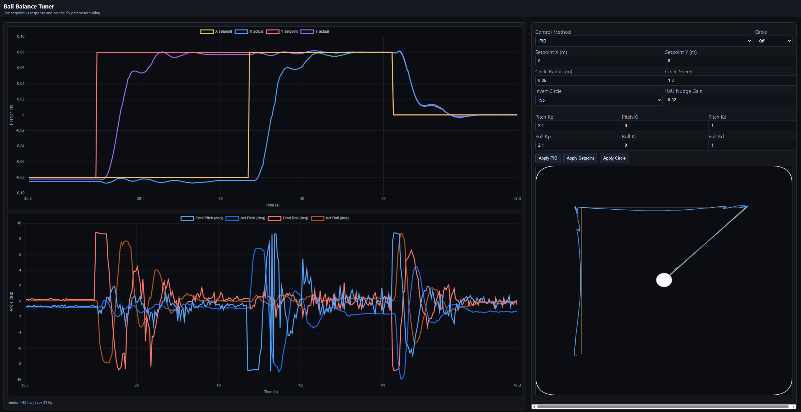

# Ball Balancing Table

A complete ball balancing control system featuring advanced reinforcement learning with **robust sim-to-real transfer**, real-time web interface, and full hardware integration. Train in simulation, deploy on hardware with minimal tuning.


*Complete system overview showing hardware integration*

## 🎬 Demos

[](https://youtu.be/B2ETYDegp2Y)

**Web Interface & Live Tuning:**

*Real-time data visualization and parameter tuning*

**Control Performance:**

*PID controller demonstration*


*RL controller adapting to mass changes in hybrid mode*

System is slightly overdamped to make sure the ball never falls off. Any big overshoot is not acceptable for control at the edges, see picture below.

*Step responses PID*

## 🎯 Key Features

### 🎛️ Control Methods
- **PID Control**: Well-tuned traditional controller with IMU feedback correction
- **SAC Reinforcement Learning**: Advanced RL with curriculum learning and robust sim-to-real transfer
- **LQR Control**: Linear-Quadratic Regulator for comparison
- **Real-time Switching**: Change control methods during operation

### 🌐 Web Interface
- **Live Data Visualization**: Real-time plots of ball position, control signals, and system metrics
- **Parameter Tuning**: Adjust PID gains, setpoints, and system parameters on-the-fly
- **Multi-device Access**: Monitor and control from any device on the network
- **Performance Monitoring**: Track control frequency, error metrics, and system health

### 🔄 Operating Modes
- **Pure Simulation**: PyBullet physics simulation for algorithm development
- **Hybrid Mode**: Real camera input with simulated physics for validation
- **Hardware Mode**: Full camera + servo + IMU deployment for real-world operation

### 🎯 Interactive Features
- **Trajectory Modes**: Circle and heart-shaped parametric paths with adjustable speed/direction
- **Manual Control**: WASD setpoint adjustment, preset positions (numpad), live parameter updates
- **Real-time Switching**: Seamlessly change controllers, modes, and parameters during operation

### 🤖 Sim-to-Real Transfer
- **Robust Domain Randomization**: Actuation biases, servo dynamics, physics variation
- **Hardware-Matched Training**: Servo rate limiting, realistic dynamics, IMU feedback
- **Minimal Real-World Tuning**: Deploy trained models with <5% performance loss
- **Automatic Adaptation**: RL handles hardware imperfections learned during training

## 🚀 Quick Start

### Installation
```bash
# Install dependencies
pip install -r requirements.txt

# Setup project directories
python setup.py
```

### Basic Usage
```bash
# Pure simulation with PID + web interface
python compare_control.py --control pid --freq 60 --visuals --web

# Test trained RL model with web monitoring
python compare_control.py --control rl --freq 60 --visuals --web

# Hardware deployment with full integration
python compare_control.py --camera real --servos --imu --freq 60 --web
```

### Train New RL Models
```bash
cd reinforcement_learning

# Train with curriculum and domain randomization
python train_rl.py --mode train --freq 60 --tensorboard --curriculum

# Test trained model
python train_rl.py --mode test --freq 60 --model ./models/best_model.zip

cd ..
```

## 🎮 Interactive Controls

**During operation:**
- `r` - Reset ball position
- `f` - Toggle fixed/random ball spawn
- `b` - Switch to PID control  
- `n` - Switch to RL control
- `i` - Toggle circle trajectory mode
- `h` - Toggle heart trajectory mode
- `q` - Quit
- **WASD** - Manual setpoint nudging
- **Numpad 1-9** - Preset corner/edge/center positions
- **Y/P** - Adjust trajectory speed
- **U/O** - Adjust trajectory radius/scale
- **K** - Reverse trajectory direction

## 🤖 Advanced RL Training

### Current Training Environment
The RL system is designed for robust sim-to-real transfer:

**Observation Space**: `[ball_x_error, ball_y_error, ball_vx, ball_vy, table_pitch, table_roll]`
- Ball positions are relative to target setpoint
- Includes optional observation noise for robustness

**Action Space**: Normalized `[-1, 1]` scaled to table angle deltas
- Actions are rate-limited to match real servo dynamics
- Includes actuation bias randomization (offsets, gains, cross-coupling)

**Reward Function** (carefully tuned for stability):
- **Distance penalty**: Exponential decay based on error to target
- **Velocity penalty**: Strong weighting (0.9) to encourage stillness
- **Control effort**: Light penalty (0.05) on action magnitude
- **Jerk penalty**: New addition (0.08) to prevent oscillation
- **Angle penalty**: Penalize extreme table tilts
- **Progress bonus**: Reward for reducing distance to target
- **PID guidance**: Bonus for following PD baseline behavior
- **Stability bonuses**: Extra reward for precise, still positioning

### Curriculum Learning
Three progressive stages automatically applied during training:

1. **Easy** (0-200k steps):
   - Small spawn range (±5cm)
   - Fixed center target
   - Minimal actuation biases
   - Conservative angle changes

2. **Medium** (200k-500k steps):
   - Larger spawn range (±8cm)
   - Randomized targets (±6cm)
   - Moderate biases and coupling

3. **Hard** (500k+ steps):
   - Full table coverage (±10cm)
   - Wide target range (±8cm)
   - Full actuation bias randomization
   - Maximum servo speed jitter

### Domain Randomization
Per-episode randomization includes:
- **Physics**: Ball mass (1.8-2.2g), friction (0.22-0.30)
- **Actuation biases**: Servo offsets (±1°), gains (±5%), cross-coupling (±5%)
- **Servo dynamics**: Speed jitter (±20%) around 60Hz rate limiting
- **Observation noise**: Position (0.001m) and velocity (0.02m/s) Gaussian noise

### Training Commands
```bash
cd reinforcement_learning

# Standard training with all features
python train_rl.py --mode train --freq 60 --tensorboard --curriculum

# Extended training without early stopping
python train_rl.py --mode train --freq 60 --tensorboard --curriculum --no-early-stop

# Resume from checkpoint
python train_rl.py --mode train --resume-from checkpoints/checkpoint_500000_steps

# Test specific model
python train_rl.py --mode test --model ./models/best_model.zip
```

## 🦾 Hardware Integration

### Servo System (Dynamixel)
- **Models**: XL430-W250-T or similar
- **Communication**: 1 Mbps, 60-63Hz update rate
- **IDs**: 1 (pitch), 2 (roll)
- **Range**: ±9° table movement
- **Kinematic Corrections**: Optional bias compensation via `servo_kinematics.json`

### IMU Integration (BNO055)
- **Real-time angle correction**: Compensates for servo/mechanical imperfections
- **Calibration**: Built-in offset calibration (press 'c' during operation)
- **RL Integration**: 0.2 correction gain for RL controller on hardware

### Camera System (RealSense D455i)
- **Ball tracking**: HSV-based detection with filtering
- **Coordinate mapping**: Automatic table-to-camera transformation
- **Modes**: Hybrid (sim physics) or Real (hardware physics)


*Blue corner markers used for camera calibration*


*Camera calibration interface showing marker detection*

## ⚙️ Configuration Options

### Control Flags
```bash
--control [pid|rl|lqr]     # Controller type
--freq 60                  # Control frequency (Hz)
--visuals                  # Enable real-time dashboard
```

### Camera Modes
```bash
--camera simulation        # Pure PyBullet (default)
--camera hybrid           # Camera + simulation physics
--camera real             # Camera + hardware physics
```

### Hardware Flags
```bash
--servos                  # Enable Dynamixel control
--imu                     # Enable IMU feedback
--imu-port COM3           # IMU serial port
--calibrate              # Run camera calibration
```

### RL-Specific Flags
```bash
--rl-swap-axes           # Swap X/Y observation axes
--rl-invert-x            # Invert X axis observation
--rl-invert-y            # Invert Y axis observation
```

## 📁 Project Structure

```
├── compare_control.py              # Main control system with PID/RL/LQR
├── pid_controller.py               # PID implementation
├── lqr_controller.py               # LQR implementation
├── servo/
│   ├── servo_controller.py         # Dynamixel control with kinematic corrections
│   ├── servo_kinematics.json       # Bias compensation parameters
│   └── servo_test.py               # Hardware testing utilities
├── camera/
│   ├── camera_interface.py         # RealSense integration
│   └── camera_calibration_color.py # Calibration tools
├── imu/
│   └── imu_simple.py               # BNO055 IMU interface
├── reinforcement_learning/
│   ├── train_rl.py                 # SAC training with curriculum
│   ├── ball_balance_env.py         # Advanced training environment
│   ├── models/                     # Trained models
│   ├── tensorboard_logs/           # Training monitoring
│   └── checkpoints/                # Training checkpoints
├── calibration_data/               # Camera calibration files
└── requirements.txt                # Python dependencies
```


*Mechanical design showing servo actuation system*


*Servo-driven platform mechanism for precise table control*

## 🎯 Current State & Performance

### ✅ Production-Ready Features
- **🤖 Robust Sim-to-Real RL**: Deploy trained models on hardware with minimal tuning
- **🌐 Real-time Web Interface**: Live monitoring, parameter tuning, multi-device access
- **🎯 Interactive Trajectory Modes**: Circle and heart-shaped paths with live controls
- **⚡ High-Frequency Control**: 100+ Hz control loops with optimized real-hardware timing
- **🔄 Seamless Mode Switching**: Change controllers, cameras, parameters during operation
- **📊 Comprehensive Monitoring**: Control frequency logging, performance metrics, system health

### 🎯 Performance Characteristics
- **PID Controller**: Sub-millimeter accuracy, excellent hardware performance with IMU correction
- **RL Controller**: Matches PID performance after sim-to-real transfer, robust to hardware variations  
- **Web Interface**: 20 Hz real-time data streaming with responsive parameter updates
- **Control Frequency**: Consistent 60+ Hz on hardware with verified servo command acceptance

### 🔬 Key Achievements
- **<5% Sim-to-Real Performance Loss**: Minimal tuning required for hardware deployment
- **Real-time Parameter Tuning**: Live PID gain adjustment through web interface
- **Robust Hardware Integration**: Handles servo imperfections, IMU drift, camera variations
- **Interactive Control**: Parametric trajectories, manual control, preset positions

## 🚀 Development Workflow

### 1. Algorithm Development
```bash
# Test in pure simulation
python compare_control.py --control pid --visuals --freq 60
```

### 2. RL Training
```bash
# Train with full curriculum and randomization
cd reinforcement_learning
python train_rl.py --mode train --freq 60 --tensorboard --curriculum
cd ..
```

### 3. Validation
```bash
# Test RL in simulation
python compare_control.py --control rl --visuals --freq 60

# Hybrid testing with camera
python compare_control.py --camera hybrid --control rl --visuals --freq 60
```

### 4. Hardware Deployment
```bash
# Full hardware deployment
python compare_control.py --camera real --servos --imu --freq 60
```

## 💡 Tips & Best Practices

### Training Considerations
- **Match frequencies**: Use 60Hz for both training and hardware
- **Curriculum is essential**: Start with `--curriculum` flag
- **Monitor TensorBoard**: Each run gets unique timestamp naming
- **Expect slow convergence**: Current reward shaping prioritizes stability over speed

### Hardware Deployment
- **Camera calibration**: Use `camera/camera_calibration_color.py` for setup
- **Axis alignment**: Use `--rl-swap-axes`, `--rl-invert-x/y` flags if needed  
- **Web monitoring**: Add `--web` flag for real-time performance monitoring
- **Servo optimization**: Test control frequency with `servo/test_servo_freq.py`

### Troubleshooting
- **RL oscillation**: Increase jerk penalty weight or reduce servo speed
- **Off-center settling**: Calibrate IMU offsets, check coordinate system alignment
- **Sluggish response**: Verify control frequency matches training (60Hz)
- **Poor transfer**: Ensure domain randomization covers actual hardware characteristics

## 📋 System Requirements

**Software:**
- Python 3.8+ (on linux)
- Python 3.11+ (on windows, else the loop time will not be quick enough)
- PyBullet (physics simulation)
- Stable-Baselines3 (SAC algorithm)
- OpenCV (camera processing)
- pyrealsense2 (camera interface)
- dynamixel_sdk (servo control)
- matplotlib (visualization)

**Hardware:**
- Intel RealSense D435i camera
- 2× Dynamixel servos (XL430-W250-T recommended)
- BNO055 IMU sensor
- USB-Serial interface for servos
- Ball balancing platform with markers